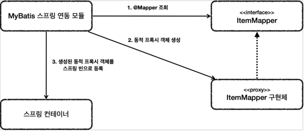
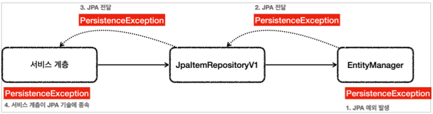
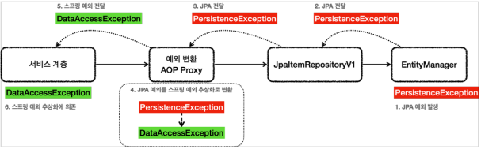
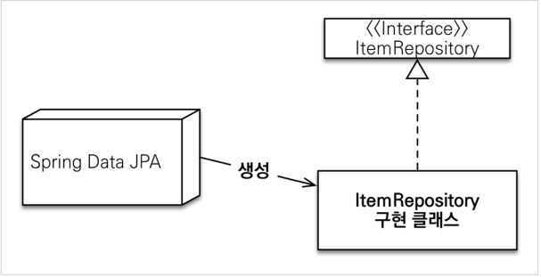
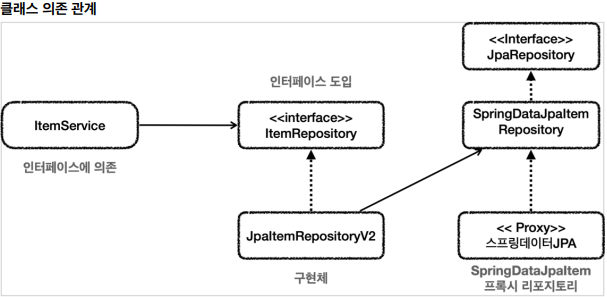
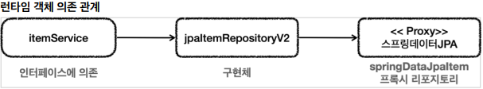
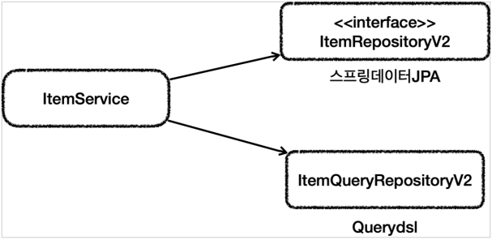

# 데이터 접근 활용 기술

## JdbcTemplate

- JdbcTemplate
- NamedJdbcTemplate
    - 이름 기반 파라미터 바인딩
- SimpleJdbcInsert
- SimpleJdbcCall

`JdbcTemplate`은 간단하고 실용적으로 SQL 을 사용할 때 사용하면 된다. 하지만, `동적 쿼리 문제`를 해결하지 못한다는 단점이 존재한다. 또한 SQL 을 자바 String 으로 직접 작성해야하기 때문에
띄어쓰기 같은 부분에 주의를 기울여야 한다.

## Test in @Transactional

<p align="center"></p>

`@Transactional` 어노테이션은 정상적으로 로직이 동작하면 트랜잭션을 커밋하게 된다. 하지만 테스트에서의 `@Transactional`은 테스트가 끝나면 트랜잭션을 자동으로 롤백시켜 버린다. 따라서
트랜잭션 범위 안에서 테스트를 진행하기 때문에 다른 테스트간에 영향을 주지 않으며, 커밋을 하지 않기 때문에 데이터가 자동으로 롤백되어 편리함이 증진된다.

> 만약 테스트에서 데이터가 제대로 저장되는지 보고 싶을때는 @Commit 어노테이션을 붙여줌으로써 확인할 수 있다.

### Embedded DB in Spring

임베디드 모드로 DB 를 만들어서 테스트를 하면 굳이 DB를 띄우지 않고도 테스트가 가능하다. 스프링에서는 테스트의 `application.properties`에 DB 설정 정보가 따로 없다면 임베디드 모드로
접근하는 `DataSource`를 만들어서 제공한다.

```properties
spring.profiles.active=test
# spring.datasource.url=jdbc:h2:tcp://localhost/~/test
# spring.datasource.username=sa
# spring.datasource.password=
logging.level.org.springframework.jdbc=debug
```

## MyBatis

JdbcTemplate 보다 더 많은 기능을 제공하는 `SQL Mapper`이다. JdbcTemplate 에 비해 SQL 을 XML에 편리하게 작성할 수 있고, 동적 쿼리를 편리하게 작성할 수 있는 장점이 있다.
다만 스프링에 내장된 기능이 아니기 때문에 MyBatis 를 위한 별도의 설정이 필요하다.

```xml
<!--SQL query-->
<update id="update">
    update item
    set item_name=#{itemName},
    price=#{price},
    quantity=#{quantity}
    where id = #{id}
</update>
```
```xml
<!--동적 쿼리-->
<select id="findAll" resultType="Item">
    select id, item_name, price, quantity
    from item
    <where>
        <if test="itemName != null and itemName != ''">
            and item_name like concat('%',#{itemName},'%')
        </if>
        <if test="maxPrice != null">
            and price &lt;= #{maxPrice}
        </if>
    </where>
</select>
```

### MyBatis ItemMapper
MyBatis 인터페이스를 만들며 따로 구현체를 만들어주지 않았지만 정상적으로 동작한다. 어떻게 이렇게 될까?

<p align="center"></p>

어플리케이션 로딩 시점에 MyBatis 스프링 연동 모듈은 `@Mapper` 어노테이션이 붙은 인터페이스를 찾는다.
찾은 인터페이스를 `동적 프록시` 기술을 이용해 `ItemMapper`구현체를 만들어 내고 이 구현체를 빈으로 등록한다.

- 즉, 매퍼 구현체로 스프링과 편리하게 연동가능하고, 추가적으로 예외 추상화도 함께 적용시켜준다.

## JPA (Java Persistence API)

JdbcTemplate 이나 MyBatis 같은 `SQL Mapper` 기술은 직접 SQL 을 개발자가 작성해야하지만,
JPA 는 `ORM데이터 접근 기술`을 이용하여 JPA 가 대신 작성하고 처리해준다. 즉, 객체와 DB 간의 패러다임 불일치를 해결해준다.
다만, JPA 단독으로만 사용시에는 동적 쿼리 작성에 어려운 점이 존재한다.

- 객체를 자바 컬렉션에 저장하듯이 DB 에 저장하게 도와준다
- ORM(Object Relational Mapping)
  - 객체는 객체대로 설계
  - 관계형 데이터베이스는 관계형 데이터베이스대로 설계
  - ORM 프레임워크가 중간에서 객체와 DB 를 매핑해준다

자세한 내용은 github 내 jpa_basic repo 를 보자!

### JPA 예외 변환

<p align="center"></p>

JPA 에서 예외가 발생하는 경우, JPA 예외가 발생한다. 왜냐면 `EntityManager`의 경우 JPA 기술이고 스프링과는 관계가 없는 기술이기에
JPA 기술에 의존적인 예외가 발생하게 된다. JPA 예외는 `PersistenceException`과 그 하위 예외를 발생시킨다.
기술에 의존적이지 않은 예외를 발생시키려면 스프링 예외 추상화를 사용해야되는데 이를 어떻게 변환시킬까?

<p align="center"></p>

- @Repository

`@Repository`는 컴포넌트 스캔의 대상이 되는 것 뿐만 아니라, `예외 변환 AOP의 적용 대상`이 된다.
즉, JPA 와 함께 사용하는 경우, 스프링은 JPA 예외 변환기를 등록하고 예외가 발생 시 예외 변환기를 통해 스프링 데이터 접근 예외로 변경 시킨다.

### Spring Data JPA

<p align="center"></p>

- `JpaRepository` 인터페이스만 상속받으면 스프링 데이터 JPA가 프록시 기술을 사용해서 구현 클래스를 만들어준다. 그리고 만든 구현 클래스의 인스턴스를 만들어서 스프링 빈으로 등록한다.
- 따라서 개발자는 구현 클래스 없이 인터페이스만 만들면 기본 CRUD 기능을 사용할 수 있다.
- 스프링 데이터 JPA 가 제공하는 쿼리 메소드 기능
  - 조회: find…By , read…By , query…By , get…By
  - 예:) findHelloBy 처럼 ...에 식별하기 위한 내용(설명)이 들어가도 된다.
  - COUNT: count…By 반환타입 long
  - EXISTS: exists…By 반환타입 boolean
  - 삭제: delete…By , remove…By 반환타입 long
  - DISTINCT: findDistinct , findMemberDistinctBy
  - LIMIT: findFirst3 , findFirst , findTop , findTop3

```text
public interface MemberRepository extends JpaRepository<Member, Long> {
    List<Member> findByUsernameAndAgeGreaterThan(String username, int age);
}
```

github 내 spring_data_jpa repo 를 확인하자!

### QueryDSL(Domain Specific Language)

JPA 에서 부족한 동적 쿼리 기능을 `Querydsl`을 이용해서 보완할 수 있다. 또한 쿼리를 `type-safe`하게 개발할 수 있게 지원해주기 때문에,
쿼리를 에러없이 작성하는데 큰 도움을 준다.

## 활용 방안

### Spring Data JPA 와 트레이드 오프(Trade-off)

<p align="center"></p>

<p align="center"></p>

`ItemService`에서 `ItemRepository`라는 인터페이스에 의존하기 때문에 확장성이 좋아졌지만 구조가 복잡해지는 단점이 존재한다.
즉, ItemService 가 바로 `SpringDataJpaItemRepository`를 바로 의존하면 직관적일 수 있고, 중간에 어댑터나 위임을 위한 클래스를
만들 필요가 없다. 이런 상황은 서로 간 `트레이드 오프(Trade-off)`가 있다고 할 수있다

- DI, OCP 를 지켜 확장성을 확보하지만, 더 많은 코드를 유지해야하는 문제
- 어탭터를 제거하고 단순한 구조를 취하지만, 확장성을 포기하는 문제
- 즉, 구조의 안정성 vs 개발의 편리성

실제 개발에서는 둘 중 하나가 정답이라고 할 수 없다. 상황에 따라 안정성이나 확장성이 중요할 때가 있고, 어떤 상황에서는 단순하게 가는게 맞는
선택 일 수도 있다. 어설픈 추상화는 독이되며, `추상화 또한 유지보수 관점에서는 비용이 소모`된다. 추상화를 타고 올라가서 여러가지 구현체에서
확인해야하는 비용 소모가 존재한다는 말이다. 따라서, 추상화는 추상화를 넘어설 만큼 효과가 있을 때 도입해야한다.

> 구조를 단순하게 진행하다가, 추상화 요소가 다수 등장하는 시점에 리팩토링을 하는 것도 좋은 방법이다.

### 복잡한 쿼리를 위한 실용적인 구조

<p align="center"></p>

- ItemRepositoryV2 는 스프링 데이터 JPA 의 기능을 제공하는 리포지토리이다.
- ItemQueryRepositoryV2 는 Querydsl 을 사용해서 복잡한 쿼리 기능을 제공하는 리포지토리이다.
- 이렇게 둘을 분리하면 기본 CRUD 와 단순 조회는 스프링 데이터 JPA 가 담당하고, 복잡한 조회 쿼리는 Querydsl 이 담당하게 된다.