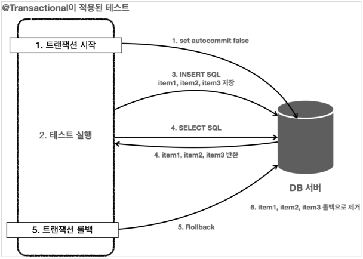

# 데이터 접근 활용 기술

## JdbcTemplate

- JdbcTemplate
- NamedJdbcTemplate
  - 이름 기반 파라미터 바인딩
- SimpleJdbcInsert
- SimpleJdbcCall

`JdbcTemplate`은 간단하고 실용적으로 SQL 을 사용할 때 사용하면 된다. 하지만, `동적 쿼리 문제`를 해결하지 못한다는 단점이 존재한다.
또한 SQL 을 자바 String 으로 직접 작성해야하기 때문에 띄어쓰기 같은 부분에 주의를 기울여야 한다.

## Test in @Transactional

<p align="center"></p>

`@Transactional` 어노테이션은 정상적으로 로직이 동작하면 트랜잭션을 커밋하게 된다.
하지만 테스트에서의 `@Transactional`은 테스트가 끝나면 트랜잭션을 자동으로 롤백시켜 버린다.
따라서 트랜잭션 범위 안에서 테스트를 진행하기 때문에 다른 테스트간에 영향을 주지 않으며, 커밋을 하지 않기 때문에 데이터가 자동으로
롤백되어 편리함이 증진된다.

> 만약 테스트에서 데이터가 제대로 저장되는지 보고 싶을때는 @Commit 어노테이션을 붙여줌으로써 확인할 수 있다.

## Embedded DB in Spring

임베디드 모드로 DB 를 만들어서 테스트를 하면 굳이 DB를 띄우지 않고도 테스트가 가능하다. 스프링에서는 테스트의 `application.properties`에
DB 설정 정보가 따로 없다면 임베디드 모드로 접근하는 `DataSource`를 만들어서 제공한다.

```properties
spring.profiles.active=test

# spring.datasource.url=jdbc:h2:tcp://localhost/~/test
# spring.datasource.username=sa
# spring.datasource.password=

logging.level.org.springframework.jdbc=debug
```