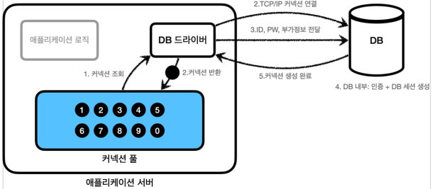
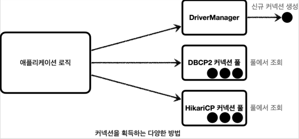

# JDBC

## Connection Pool

데이터베이스가 `Connection`을 획득하기 위한 순서는 다음과 같다.

1. 애플리케이션에서 DB 드라이버를 통해 `Connection`을 조회
2. DB 드라이버는 DB와 TCP/IP 커넥션을 연결하며, 이 과정에서 3 way handshake 같은 TCP/IP
   연결을 위한 네트워크 동작이 발생
3. DB 드라이버는 TCP/IP 커넥션이 연결되면 ID, PW와 기타 부가정보를 DB에 전달하고 내부 인증을 완료하고, 내부에 DB 세션을 생성
4. DB는 커넥션 생성이 완료되었다는 응답을 보낸다.
5. DB 드라이버는 커넥션 객체를 생성해서 클라이언트에 반환한다.

이처럼 커넥션을 만드는 건 여러가지 과정이 필요하고 시간이 필요하다. 사용자 입장에서는 데이터를 가져오는 시간 뿐만 아니라,
커넥션을 새로 생성하고 가져오는 시간도 추가적으로 필요하게된다. 이러한 문제를 해결하기 위해, 커넥션을 미리 생성해두고
사용하는 것을 `Connection Pool(커넥션 풀)`이라는 방법이 존재한다

### 커넥션 풀의 동작

1. 어플리케이션 시작 시, 어플리케이션 서버 내 커넥션 풀에 필요한 만큼 커넥션을 미리 연결하고 풀에 보관한다.
2. 사용자가 SQL을 요청하면, DB 드라이버가 아닌 커넥션 풀에 커넥션을 요청한다
3. 커넥션 풀의 커넥션을 이용하여 SQL을 실행한다
4. 사용자는 커넥션을 종료하는 것이 아닌 그대로 커넥션 풀에 다시 반환한다.
5. 만약 커넥션 풀에 존재하는 커넥션보다 요청이 많을 경우, block 상태로 대기한다

## DataSource

커넥션을 획득하는 방법은 여러가지가 존재한다. 만약 어플리케이션 로직에서 DriverManager 를 사용하다가 
HikariCP 로 변경하고 싶다면, 어플리케이션 코드를 변경해야하는 번거로움이 존재한다.
하지만 java 에서는 이를 추상화한 `DataSource`라는 인터페이스를 통해 커넥션을 조회할 수 있는 방법을 제공한다.
정리하자면 다음과 같다.

- 대부분의 커넥션 풀은 `DataSource` 인터페이스를 이미 구현해놨기에, 개발자는 `DataSource` 인터페이스에만 의존하도록
  애플리케이션 로직을 작성하면 된다.
- 커넥션 풀 구현 기술을 변경하고 싶으면 해당 구현체로 갈아끼우기만 하면 된다.
