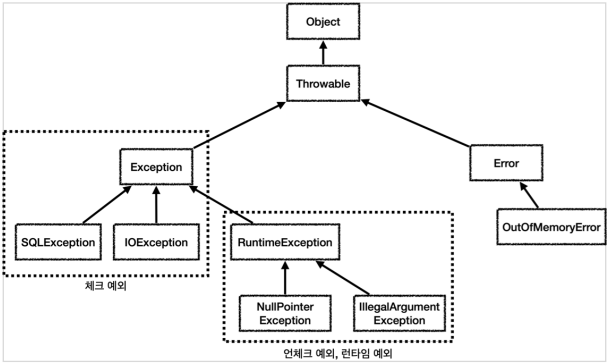
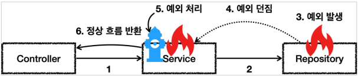
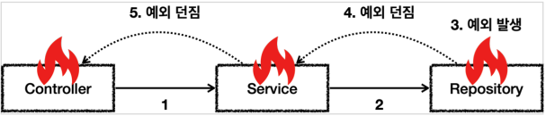
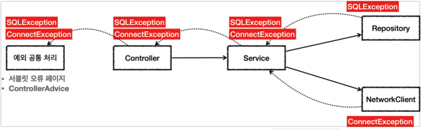
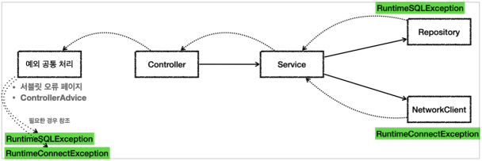

# Java Exception

## 예외 계층

<p align="center"></p>

#### Throwable

최상위 예외이며, 하위에 `Exception`과 `Error`가 존재한다

#### Error

메모리 부족이나 시스템 오류같이 어플리케이션에서 복구가 불가능한 시스템 예외이다. 따라서,
어플리케이션 개발자는 `Error`를 처리하기 위해 코드를 작성하진 않는다.

- 상위 예외에서 `catch`로 예외를 잡으면 하위 예외도 같이 잡히게 된다.
  - 즉, `Throwable`을 catch 하게 되면 하위 Error 와 Exception 모두 잡히게 되므로, `Exception`만을 잡으면 된다.
- Error 는 언체크 예외이다.

#### Exception

어플리케이션 로직에서 사용할 수 있는 실질적인 최상위 예외이다.

- `Exeception`과 그 하위 예외는 컴파일러가 체크하는 체크 예외이다.
- 단, `RunTimeException`만은 예외로 언체크 예외이다.
  - RunTimeException 의 자식 또한 언체크 예외
  - 런타임 예외라고 많이 부른다.


## 예외의 기본 규칙

1. 예외 = 폭탄돌리기, 잡아서 처리하거나 밖(호출한 쪽)으로 던지는 구조이다.
2. 예외를 잡거나 던질 때 지정한 예외 뿐 아니라 그 자식 예외들도 함께 처리된다. 

#### 예외처리

<p align="center"></p>

#### 예외 밖으로 던짐

<p align="center"></p>

## 체크 예외

`RuntimeException`을 제외한 `Exception`과 그 하위 예외는 모두 컴파일러가 체크하는 체크예외이다.
체크 예외는 잡아서 처리하거나 밖으로 던지게 선언해줘야 한다.

- 장점
  - 개발자가 실수로 예외를 누락하더라도 컴파일러를 통해 사전에 이를 확인할 수 있다
- 단점
  - 모든 체크 예외에 대한 처리를 해줘야하기에 번거로움이 발생한다.

### 체크 예외 활용

기본적으로 언체크(런타임) 예외를 사용하고 체크 예외는 `의도적으로 던지는 예외`에만 사용한다.

- 반드시 처리해야되는 문제인 경우에만
  - 계좌이체의 실패
  - 로그인 ID, PW 불일치

### 체크 예외의 문제점

<p align="center"></p>

서비스나, 컨트롤러 입장에서 해결할 수 없는 체크 예외들은 밖으로 던져야하기 때문에, 항상 선언을 추가하여 밖으로 던져줘야한다.

1. 복구 불가능한 예외
   - 대부분의 예외는 복구 불가능하다
   - 이런 문제들을 일관성 있게 공통으로 처리해야한다.
2. 의존 관계에 대한 문제
   - 복구 불가능한 예외이지만, 체크 예외이기 때문에 본인이 처리할 수 없더라도 `throws`를 통해 예외를 선언해야한다.
   - 하지만 이게 문제인 이유는 컨트롤러나 서비스가 `SQLException`과 같은 `특정 기술의 예외에 의존`하게 된다는 점이다.
   - 따라서 특정기술을 다른 기술로 대체하는 경우 Exception 또한 `다른 기술의 Exception 으로 변경`해줘야한다!

## 언체크 예외

`RuntimeException`과 그 하위 예외는 언체크 예외로 분류된다. 언체크 예외도 체크 예외와 기본적을 동일하지만, `throws`를 생략할 수 있다.
이런 경우 자동으로 예외를 던지게 된다.

- 장점
  - 신경쓰고 싶지 않은 언체크 예외를 무시할 수 있다.
  - 체크 예외는 항상 throws 를 선언해줘야하지만, 언체크는 이를 생략할 수 있다.
- 단점
  - 개발자의 실수로 예외를 누락할 수 있다.

### 언체크(런타임) 예외 활용

<p align="center"></p>

런타임 예외는 서비스, 컨트롤러는 해당 예외를 처리할 수 없다면 별도의 선언없이 그냥 밖으로 던질 수 있다.
따라서, 컨트롤러와 서비스에서 해당 예외에 대한 의존관계가 발생하지 않는다. 구현기술에 의존하지 않아도 되며, 공통으로 처리하는 곳에서는
예외에 따른 처리가 필요할 수 있다.

- 런타임 예외는 문서화를 잘 해줘야한다
- 또는 코드에 `throws 런타임예외`를 남겨서 중요한 예외를 인지할 수 있게 해줘야한다

```java
/**
 * Make an instance managed and persistent.
 * @param entity entity instance
 * @throws EntityExistsException if the entity already exists.
 * @throws IllegalArgumentException if the instance is not an
 * entity
 * @throws TransactionRequiredException if there is no transaction when
 * invoked on a container-managed entity manager of that is of type
 * <code>PersistenceContextType.TRANSACTION</code>
 */
```

## 예외 포함과 스택 트레이스

예외를 변환할 때는 `꼭 기존 예외를 포함`해야 한다. 그렇지 않으면 스택 트레이스를 확인할 때 문제가 발생할 수 있다.

```java
static class Repository {
        public void call() {
            try {
                runSQL();
            } catch (SQLException e) {
                throw new RuntimeSQLException(e); // 기존 예외(e)를 포함
            }
        }

        public void runSQL() throws SQLException {
            throw new SQLException("ex");
        }
    }
```

예외 변환시 기존 예외를 포함하지 않으면, 뭐 때문에 런타임 에러가 발생했는지 추적할 수가 없다!

