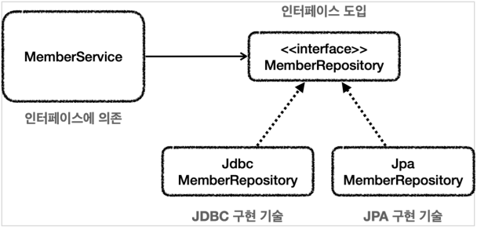
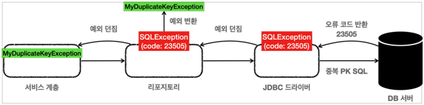

# Exception in Spring

## 체크 예외와 인터페이스

앞서 말했듯이 서비스 계층은 특정 기술에 의존적이지 않아야 하는데, 지금까지 만든 서비스(MemberServiceV3)에서는 아직
`SQLException`이라는 jdbc 기술에 의존적이다.
이렇게 서비스가 처리할 수 없는 체크 예외는 어떻게 처리해야할까? 이런 체크 예외는 런타임 예외로 전환해서 서비스 계층으로 던지는 것이
서비스 계층에서 해당 예외를 무시할 수 있기 때문에 특정 기술에 의존하지 않고 순수하게 유지 가능하다.

### 인터페이스 도입

<p align="center"></p>

먼저 `Repository`를 인터페이스화 해서 구현 기술 변경이 용이하게 한다. 하지만 인터페이스를 만들 때, 한가지 문제점이 발생한다.
`SQLException`이라는 체크 예외를 처리하려면 인터페이스에도 동일하게 예외가 선언되어야한다. 그래야 구현 클래스에서도 체크 예외를 던질 수 있다.
하지만 이렇게 되면 인터페이스 또한 특정 기술에 종속되게되는 문제가 발생한다.

### 런타임 예외와 인터페이스

런타임 예외는 인터페이스에 따로 선언하지 않아도 되기 때문에 이로부터 자유로워진다.
체크 예외를 런타임 예외로 변환할 때는 `반드시 기존 예외를 포함`시켜야 기존 원인이 되는 부분을 확인할 수 있다.

```text
catch (SQLException e) {
            throw new MyDbException(e);
        } 
```

### 남은 문제

체크 예외를 런타임 예외로 변경함으로써, 특정 기술에 의존하던 부분은 사라지고 서비스 계층의 순수성을 유지할 수 있게 변경되었다.
하지만, `Repository`에서 넘어오는 예외는 `MyDbException`이라는 예외만이 존재하기에 예외를 구분할 수 없는 문제가 발생한다.
만약 특정한 상황에서 넘어오는 예외는 잡아서 복구하고 싶은 경우 어떻게 해야할까?

## 데이터 접근 예외 직접 만들기

<p align="center"></p>

특정한 상황에서 복구하고 싶은 예외는 어떻게 처리해야할까? 데이터베이스는 발생하는 오류에 대해 특정 오류코드를 반환하게 되어있다.
따라서 jdbc 의 `SQLException`의 경우 데이터베이스에서 제공하는 오류코드를 `errorCode`에 담아 보내게 된다. 따라서 이 에러코드를
확인하여 데이터베이스에 어떤 문제가 발생했는지 확인할 수 있다. 참고로 데이터베이스마다 정의된 오류코드가 다르다.

```text
H2 데이터베이스의 에러코드
23505: 키 중복 오류
42000: SQL 문법 오류
```

하지만 서비스 계층에서는 특정 예외 복구를 위해 특정 에러 코드를 처리하기 위해선 데이터베이스 마다의 에러 코드를 알고 있어야한다.
즉, 데이터베이스가 바뀌게 되면 에러코드를 모두 바꿔줘야하며 나아가 많은 수의 에러들이 존재하는데 이를 일일히 `Exception`을 만들고
체크 예외를 런타임 에러로 변환해줘야하는 단점이 있다. 