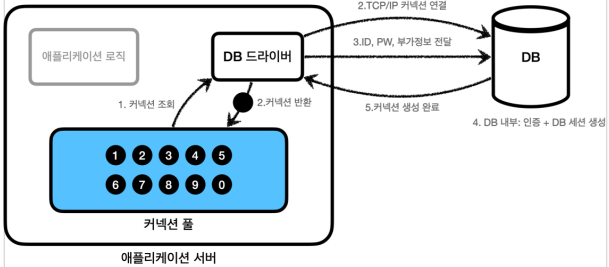
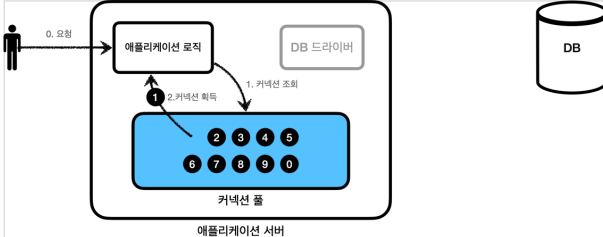
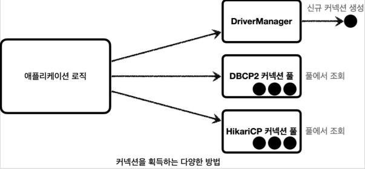
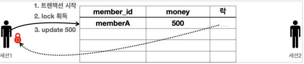
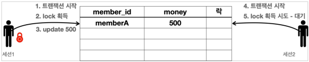

# JDBC

## Connection Pool

데이터베이스가 `Connection`을 획득하기 위한 순서는 다음과 같다.

1. 애플리케이션에서 DB 드라이버를 통해 `Connection`을 조회
2. DB 드라이버는 DB와 TCP/IP 커넥션을 연결하며, 이 과정에서 3 way handshake 같은 TCP/IP 연결을 위한 네트워크 동작이 발생
3. DB 드라이버는 TCP/IP 커넥션이 연결되면 ID, PW와 기타 부가정보를 DB에 전달하고 내부 인증을 완료하고, 내부에 DB 세션을 생성
4. DB는 커넥션 생성이 완료되었다는 응답을 보낸다.
5. DB 드라이버는 커넥션 객체를 생성해서 클라이언트에 반환한다.

이처럼 커넥션을 만드는 건 여러가지 과정이 필요하고 시간이 필요하다. 사용자 입장에서는 데이터를 가져오는 시간 뿐만 아니라, 커넥션을 새로 생성하고 가져오는 시간도 추가적으로 필요하게된다. 이러한 문제를 해결하기
위해, 커넥션을 미리 생성해두고 사용하는 것을 `Connection Pool(커넥션 풀)`이라는 방법이 존재한다

### 커넥션 풀의 동작

1. 어플리케이션 시작 시, 어플리케이션 서버 내 커넥션 풀에 필요한 만큼 커넥션을 미리 연결하고 풀에 보관한다.
2. 사용자가 SQL을 요청하면, DB 드라이버가 아닌 커넥션 풀에 커넥션을 요청한다
3. 커넥션 풀의 커넥션을 이용하여 SQL을 실행한다
4. 사용자는 커넥션을 종료하는 것이 아닌 그대로 커넥션 풀에 다시 반환한다.
5. 만약 커넥션 풀에 존재하는 커넥션보다 요청이 많을 경우, block 상태로 대기한다

## DataSource

커넥션을 획득하는 방법은 여러가지가 존재한다. 만약 어플리케이션 로직에서 DriverManager 를 사용하다가 HikariCP 로 변경하고 싶다면, 어플리케이션 코드를 변경해야하는 번거로움이 존재한다. 하지만
java 에서는 이를 추상화한 `DataSource`라는 인터페이스를 통해 커넥션을 조회할 수 있는 방법을 제공한다. 정리하자면 다음과 같다.

- 대부분의 커넥션 풀은 `DataSource` 인터페이스를 이미 구현해놨기에, 개발자는 `DataSource` 인터페이스에만 의존하도록 애플리케이션 로직을 작성하면 된다.
- 커넥션 풀 구현 기술을 변경하고 싶으면 해당 구현체로 갈아끼우기만 하면 된다.

## Transaction

데이터베이스를 사용하는 이유 중 하나는 `Transaction(트랜잭션)`을 지원하기 때문이다. 트랜젝션이란 데이터베이스에서 처리하는 하나의 작업 단위를 안전하게 처리하는 것을 보장하는 것이다.

### Transaction ACID

- Atomicity (원자성)
    - 트른잭션 내에서 실행된 작업들은 마치 하나의 작업인 것처럼 모두 성공하거나 모두 실패해야한다
- Consistency (일관성)
    - 모든 트랜잭션은 일관성있는 데이터베이스 상태를 유지해야한다
    - 데이터베이스에서 정한 무결성 제약조건을 만족해야한다.
- Isolation (격리성)
    - 동시에 실행되는 트랜잭션들은 서로에게 영향을 끼치면 안된다
    - 동시성과 관련된 성능 이슈로 인해 트랜잭션 격리 수준(isolation level)을 설정할 수 있다.
- 지속성 (Durability)
    - 트랜잭션이 성공하면 결과를 항상 기록되어야 한다.
    - 중간에 시스템에 문제가 생기더라도 로그를 통해서 성공한 트랜잭션 내용을 복구해야한다.

#### Isolation level (격리 수준)

아래로 내려갈 수록 성능이 느려지지만, 격리성을 보장받을 수 있다.

- READ UNCOMMITTED (커밋되지 않은 읽기)
- READ COMMITTED (커밋된 읽기)
- REPEATABLE READ (반복 가능한 읽기)
- SERIALIZABLE (직렬화 가능)

## DB Lock

세션 A가 트랜잭션을 시작하고 데이터를 수정하는 동안 아직 커밋을 하지 않았는데, 세션 B가 동시에 같은 데이터를 수정하게되면 트랜잭션의 `원자성`이 손상된다. 거기에 더해 세션 A이 중간에 롤백을 수행하면, 세션
B는 잘못된 데이터를 수정하는 문제가 발생한다. 이 문제를 해결하기 위해, 세션이 트랜잭션을 시작하고 데이터를 수정하는 동안 커밋이나 롤백 전까지 다른 세션에서 데이터를 수정할 수 없게 하는 것이 `DB Lock`
이다.

### update

두 세션이 같은 데이터를 수정했을 때 DB Lock 의 동작은 다음과 같다

1. 세션 A가 트랜잭션을 시작한다
2. 세션 A는 데이터 수정을 시도하고, 해당 `row의 lock`을 획득 시도를 하게된다
3. 락이 남아 있다면 세션은 lock 을 획득하고 수정을 진행한다.

4. 세션 B가 트랜잭션을 시작한다
5. 세션 B도 같은 row 의 데이터 수정을 시도하고, 락을 획득하기 위한 시도를 진행한다
6. lock 이 없으므로 lock 이 돌아올 때 까지 대기한다. `lock timeout`이 존재하며, 이를 초과할 시 에러 발생.
7. 세션 A가 커밋을 수행하고 트랜잭션이 종료되고 락을 반납한다.
8. Lock 을 대기하던 세션B 는 락을 획득하고 수정을 진행한다.
9. 세션 B도 트랜잭션을 종료하고 락을 반납한다.

### select

일반적으로 조회에서는 lock 을 획득하지 않고 데이터를 조회할 수 있다. 하지만 데이터를 조회할 때도 lock 을 획득하는 방법이 존재한다. `select for update` 를 사용하면 가능한데, 조회시점에
lock 을 획득하여 다른 세션이 해당 데이터를 변경할 수 없게한다.

- 조회 트랜잭션 종료 시점까지 다른 곳에서 변경하지 못하게 `강제로` 막아야 할 때
- 예를 들어, 돈과 관련된 중요한 계산이 조회 후 진행된다고 가정하면 이 계산이 끝날 때 까지 데이터 수정을 원하지 않을 수 있다.

> select for update 를 사용하더라도 다른 세션에서 조회는 가능하다.

## JDBC 반복 문제 해결

- 커넥션 조회, 커넥션 동기화
- `PreparedStatement` 생성 및 파라미터 바인딩
- 쿼리 실행 및 결과 바인딩
- 예외 발생 시, 스프링 예외 변환
- 리소스 해제 및 종료

스프링은 이러한 JDBC 반복 문제를 해결하기위한 `JdbcTemplate`을 제공한다. `JdbcTemplate`는 트랜잭션을 위한 커넥션 동기화와
더불어 예외 발생시 스프링 예외 변환 또한 실행해준다.