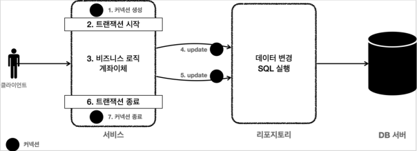
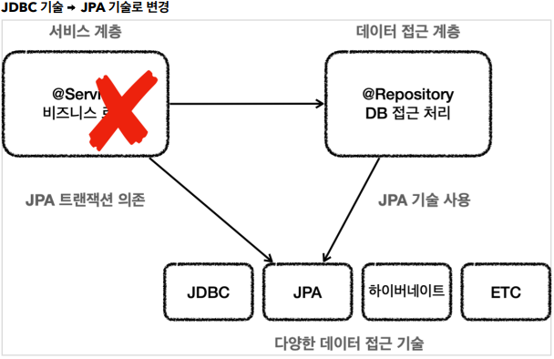
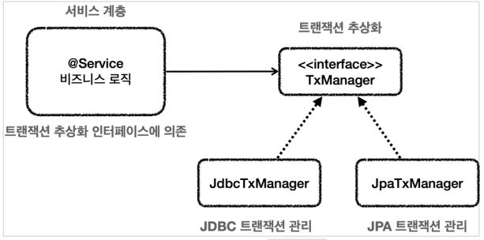
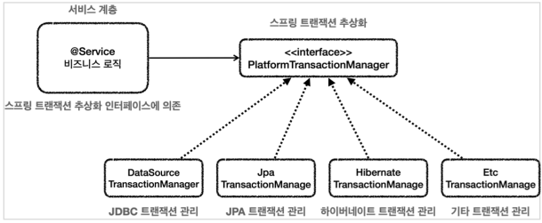
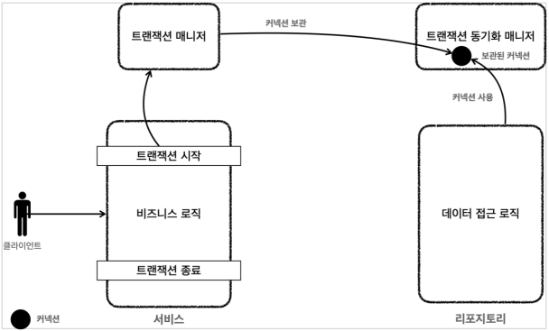
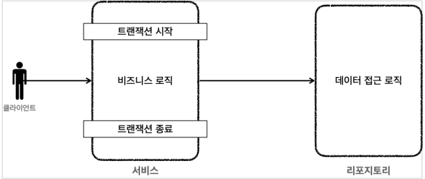
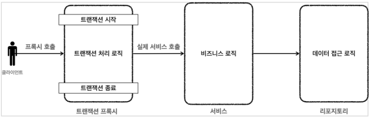

# Transaction in Spring

## 비지니스 로직과 트랜잭션

<p align="center"></p>

트랜잭션은 비지니스 로직이 잘못되면 해당 부분을 롤백해야 하기 때문에 `서비스 계층에서 시작`해야한다. 트랜잭션을 시작하기 위해서 필요한게 뭘까? 바로 커넥션(Connection). 우리가 Sql
로 `auto commit false` 와 `commit`을 하는 부분을 커넥션을 통해 진행하게된다. 따라서 같은 세션을 사용해야 하기에 `하나의 트랜잭션 내에서는 같은 커넥션`을 유지해야한다.

### JDBC 의 한계

어플리케이션을 개발할 때 기본적으로 UI 관련 처리가 있는 `프레젠테이션 계층`, 비지니스 로직이 있는 `서비스 계층`, 그리고 DB 에 접근하는
`데이터접근 계층`으로 나눌 수 있다. 그 중 서비스 계층은 다른 계층이 상황이나 필요에 따라 변경되더라도 최대한 변경이 없이 유지되야 한다. 그렇기에 특정 기술에 종속되면 안되고, 순수한 비지니스 로직만을 담을 수
있도록 노력해야 한다.

- 프레젠테이션 계층
    - UI 와 관련된 웹, 서블릿, HTTP 와 관련된 부분을 담당한다.
- 데이터 접근 계층
    - 데이터를 저장하고 관리하는 기술을 담당하고, JDBC, JPA 와 같은 구체적인 데이터 접근 기술을 사용해 구현한다.

하지만 `MemberServiceV2`를 살펴보면, 비지니스 로직에 반드시 필요한 트랜잭션을 구현함으로써 JDBC 라는 데이터 접근 계층 기술과 비지니스 로직이 혼재되는 문제점과 더불어 다음과 같은 문제점이 발생한다

- JDBC 구현 기술이 서비스 계층, 비지니스 로직에 혼재되는 문제점
- 트랜잭션 동기화 문제
    - 같은 트랜잭션을 유지하기 위해 `Connection` 객체를 항상 들고다녀야 된다.
- 트랜잭션 코드를 위한 반복
    - try, catch, finally
- 예외 누수
    - 앞서 말했듯 서비스 계층과 데이터 접근 계층의 사용 기술은 다르며, 각 계층에서 처리되어야 하는 예외도 별도로 존재한다
    - 하지만, 현재는 JDBC 에러인 `SQLException`이 서비스 계층에 존재하기에 이를 내부에서 처리하거나 밖으로 던져서 처리해야 한다.

## 트랜잭션 추상화

<p align="center"></p>

현재 서비스 계층에서는 JDBC 기술을 통해 트랜잭션을 사용하고 있다. 하지만, JPA 같은 다른 기술을 사용하게 된다면 어떻게 될까? 이렇게 기술이 달라지게 되면, 트랜잭션 관련된 코드를 모두 새롭게 적용되는
기술에 맞춰 변경해야되는 문제점이 생기게된다. 이런 문제점을 해결하기 위해, 트랜잭션을 추상화하여 특정 기술에 의존하는 것이 아닌 인터페이스에 의존하게 하는 것이 트랜잭션 추상화이다.

<p align="center"></p>

추상화된 인터페이스에 원하는 구현체를 의존성 주입(DI) 함으로써 OCP 원칙을 지키고, 서비스 코드의 변경없이 트랜잭션 기술을 사용할 수 있다.

### 스프링의 트랜잭션 추상화

<p align="center"></p>

스프링에서는 `PlatformTransactionManager`를 통해 추상화를 해두었고, 트랜잭션 구현체 또한 구현해뒀기 때문에, 이를 통해 쉽고 편리하게 트랜잭션을 구현할 수 있다. 이를 `트랜잭션 매니저`
라고한다. 트랜잭션 매니저는 크게 `트랜잭션 추상화`와 `리소스 동기화`하는 역할을 담당한다.

### 리소스 동기화와 Transaction Manager (MemberServiceV3_1)

트랜잭션을 서비스 로직의 시작부터 마지막까지 유지하기 위해서는 동일한 데이터베이스 커넥션을 유지해야한다. 그렇기에 `MemberServiceV2`에서 보면 트랜잭션이 필요한 곳에는 커넥션을 항상 같이 넘겨줘야하는
단점이 존재한다. 그렇기에 코드 중복이 생기고, 불필요한 오버로딩이 생기는 단점이 있다. 트랜잭션 매니저는 이런 단점을 보완할 수 있다.

<p align="center"></p>

- 트랜잭션 동기화 매니져를 통해 커넥션을 동기화해준다
- `ThreadLocal`을 사용하기에 멀티쓰레드 상황에서도 안전하게 동기화가 가능하다
- 커넥션이 필요한 경우, 동기화 매니져에게 요청하여 받아올 수 있으므로 파라미터로 넘기는 작업을 줄일 수 있다.
- 동작 방식
    1. 트랜잭션 매니저는 데이터소스를 통해 커넥션을 만들고 트랜잭션을 시작한다.
    2. 트랜잭션 매니저는 트랜잭션이 시작된 커넥션을 트랜잭션 동기화 매니저에 보관한다.
    3. 데이터 접근 로직에서 사용되는 커넥션은 트랜잭션 동기화 매니저에 보관된 커넥션을 꺼내서 사용한다.
    4. 트랜잭션이 종료되면 트랜잭션 매니저는 트랜잭션 동기화 매니저에 보관된 커넥션을 통해 트랜잭션을 종료하고, 커넥션도 닫는다.

### Transaction Template (MemberServiceV3_2)

```java
public class TransactionTemplate {
    private PlatformTransactionManager transactionManager;

    public <T> T execute(TransactionCallback<T> action) {}

    void executeWithoutResult(Consumer<TransactionStatus> action) {}
}
```

`TransactionManager`를 사용하더라도 commit 과 rollback 등 트랜잭션을 종료하는 패턴은 여전히 반복된다. 트랜잭션을 사용하는 모든 패턴에서 이와 같은 작업이
반복되는데, `Transaction Template`를 사용함으로써 이를 개선할 수 있다.

- 트랜잭션 템플릿은 템플릿 콜백 패턴으로 이루어져 있다.
- 트랜잭션 템플릿을 통해 실행한 비지니스 로직은 정상 호출되는 경우 자동으로 `commit`을 호출하고, `실패시 rollback`을 호출한다.

---

## 트랜잭션 AOP

<p align="center"></p>

트랜잭션 추상화와 트랜잭션 템플릿을 통해 트랜잭션을 사용하는 편리성과 중복을 많이 제거할 수 있었지만,
서비스 계층에 비지니스 로직만을 담으려는 문제는 해결되지 못했다. 이 문제는 `Spring AOP`를 도입함으로써,
해결할 수 있다.

<p align="center"></p>

Spring AOP 의 `@Aspect`, `@Advice`, `@Pointcut` 를 사용해서 트랜잭션 처리용 AOP를 만들 수도 있다.
하지만, 트랜잭션은 매우 빈도가 높고 중요한 기능이기에 스프링에서 트랜잭션을 처리하기 위한 기능을 제공한다.
개발자는 트랜잭션이 필요한 곳에 `@Transactional` 어노테이션을 통해 트랜잭션을 처리할 수 있다.