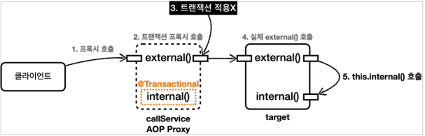
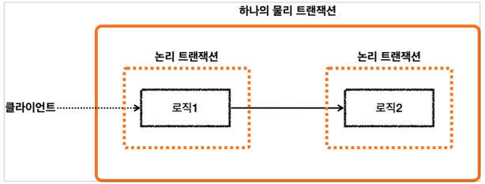

# Transaction Internal

## 프록시의 적용

<p align="center"></p>

`@Transactional`을 붙인 클래스나 메소드는 트랜잭션 AOP 에 따라 `프록시를 생성`하여 스프링 컨테이너에 등록된다. 즉, 실제 객체나 메서드가 아닌 `프록시 객체가 컨테이너에 등록`되는게 핵심이다.
프록시 객체는 실제 객체를 상속받아 만들어지므로 동작에는 영향이 없다.

- 트랜잭션이 적용되는 대상은 프록시 객체를 통해 트랜잭션을 시작하고 실제 참조 대상에게 작업을 요청한다
- 적용대상이 아닌 경우에는 프록시 객체는 단순히 실제 참조 대상에게 작업을 위임한다.

## 프록시 내부 호출 (매우 중요)

`@Transactional`을 호출하면 스프링의 트랜잭션 AOP 가 적용되고 `프록시 객체가 먼저 트랜잭션 처리 후 실제 객체가 호출`된다. 따라서 항상 프록시를 통해서 대상 객체를 호출해야 하는데, 만약 프록시를
거치지 않고 대상 객체를 먼저 호출하게 되면 `당연히 AOP 와 트랜잭션도 적용되지 않을 것`이다.

<p align="center"></p>

일반적으로 스프링 의존관계 주입 시, 프록시 객체가 주입되기에 직접 대상 객체를 호출할 일은 발생하지 않는다. 하지만,` 대상 객체의 내부에서 메서드 호출이 발생`한다면 프록시를
건너뛰고 `대상 객체를 직접 호출하는 문제`가 발생한다.(InternalCallV1Test)

- 대상 객체 내부에서 별도의 참조 없이 `this.`를 통해 호출되는 메서드는 프록시 객체를 통해 실행하는 것이 아니라, 대상 객체를 직접호출하게 된다.
- 프록시 방식의 AOP 한계
    - 프록시를 사용하면 메서드 내부 호출에 프록시를 적용할 수 있는 한계점이 있다.

<p align="center"></p>

이를 해결하는 방법이 여러가지가 있지만 가장 합리적인 방법은 트랜잭션이 있는 메서드를 별도의 클래스로 분리하는 것이다.
(InternalCallV2Test)

## 초기화 시점 (IntTxTest)

초기화 이후에 트랜잭션 AOP 가 적용되기 때문에, `@PostConstruct`시점에는 `@Transactional`을 적용할 수 없다.
따라서 `@EventListener(ApplicationReadyEvent.class)`를 이용해 스프링이 모두 시작된 이후에 트랜잭션을 적용하면 이를 해결할 수 있다.

## Transaction Option

```java
public @interface Transactional {
    String value() default "";

    String transactionManager() default "";

    Class<? extends Throwable>[] rollbackFor() default {};

    Class<? extends Throwable>[] noRollbackFor() default {};

    Propagation propagation() default Propagation.REQUIRED;

    Isolation isolation() default Isolation.DEFAULT;

    int timeout() default TransactionDefinition.TIMEOUT_DEFAULT;

    boolean readOnly() default false;

    String[] label() default {};
}
```

- value, transactionManager
    - 어떤 트랜잭션 매니져를 사용할지 정하는 옵션
    - 기본적으로 생략하여 디폴트를 사용하지만, 트랜잭션 매니저가 둘 이상이라면 값을 지정해줘야 한다
- rollbackFor
    - 기본적으로 언체크 예외와 그 하위 예외는 롤백하며, 체크 예외인 `Exception`과 그 하위 예외는 커밋하게 된다.
    - 하지만 추가로 롤백 할 예외를 지정할 수 있다
    - `@Transactional(rollbackFor = Exception.class)`
- noRollbackFor
    - `rollbackFor`의 반대 개념
- isolation
    - 트랜잭션 격리 수준 지정
    - 디폴트는 데이터베이스가 설정한 격리 수준을 따르게 한다
- timeout
    - 트랜잭션 수행 시간에 대한 타임아웃을 초 단위로 설정
    - 기본 값은 시스템의 타임아웃
- readOnly
    - 기본적으로 읽기 쓰기가 모두 가능한 트랜잭션이 생성되지만, `readOnly = true`의 경우 읽기 전용 트랜잭션이 생성된다.
    - 이 옵션을 통해 읽기에서 다양한 `성능 최적화`가 발생할 수 있다

### readOnly 가 적용되는 위치

1. 프레임워크
    - `JdbcTemplate`에서 읽기 전용 트랜잭션에서 변경이 동작하면 예외를 발생시킨다.
    - `JPA`에서는 플러시를 호출하지 않는다.
        - 추가적으로 변경 감지를 위한 스냅샷 객체 또한 생성하지 않으며, 여러 최적화가 발생한다
2. JDBC driver
    - DB 와 드라이버 버젼에 따라 다르게 동작하기 때문에 사전 확인이 필요하다
    - 읽기 전용 트랜잭션에서 변경쿼리 발생 시 예외를 발생시킨다.
    - 읽기, 쓰기 데이터베이스를 구분해서 커넥션을 획득하여 요청한다.
3. 데이터베이스
    - 데이터베이스에 따라 다르며, 읽기 전용 트랜잭션의 경우 내부에서 성능 최적화가 발생한다.

## Exception in Transaction

<p align="center"></p>

예외 발생 시, 스프링 트랜잭션 AOP 는 예외 종류에 따라 커밋 또는 롤백이 동작한다

- 언체크 예외인 RuntimeException, Error 및 그 하위 예외는 `롤백` (RoolbackTest)
- 체크 예외인 Exception 과 그 하위 예외는 `커밋`

### 왜 예외에 따라 커밋과 롤백이 갈릴까?

스프링은 기본적으로 체크 예외는 비지니스 의미가 있을 때 사용하고, 런타임 예외는 복구 불가능한 예외로 가정한다. 비지니스 의미가 있다는 말은 뭘까?

- 예를 들어, 물건 주문시 시스템에 오류가 발생하면 복구 불가능한 런타임 에러로 볼 수 있다
- 하지만, 잔고가 부족해서 주문이 불가하면 비지니스 로직에 따라 주문 상태를 저장하고 대기 상태로 가거나 주문을 취소하거나 하는 방법을 선택할 수 있다.
  - 이런 예외는 시스템은 정상이지만, 비지니스 상황 때문에 발생한 예외이다.
  - 비지니스 예외는 중요하고 반드시 처리해야하는 경우이기 때문에 체크 예외로 고려할 수 있다.(`NotEnoughMoneyException`)

## Transaction Propagation (트랜잭션 전파)

### 기본

<p align="center"></p>

트랜잭션이 각각 사용되는 것이 아닌, 하나의 트랜잭션이 진행 중에 추가로 트랜잭션을 수행하면 어떻게 될까?
트랜잭션을 별개로 처리해야 될지 아니면 하나로 처리해야 될지를 정하는 것이 `트랜잭션 전파`이다.
스프링은 여러가지 트랜잭션 전파 옵션을 제공하며, 기본 옵션인 `REQURIRED` 부터 살펴보자.

<p align="center"></p>

스프링은 기본적으로 트랜잭션이 동작하는 중에 또다른 트랜잭션이 동작할 경우 이를 하나의 트랜잭션으로 처리한다.
하지만 이렇게 하나로 묶고나면 `개별적인 트랜잭션은 어떻게 될지`에 대한 의문점이 들 수 있다.

### 물리, 논리 트랜잭션

<p align="center"></p>

스프링은 하나로 묶인 트랜잭션과 개별적인 트랜잭션을 구별하기 위해 `물리, 논리 트랜잭션` 개념을 사용한다.

- 논리 트랜잭션은 우리가 예제에서 `TransactionManager`로 만든 개별적인 트랜잭션으로, 이들을 묶어 하나의 물리 트랜잭션을 만든다
- 물리 트랜잭션은 실제 데이터베이스에 적용되는 트랜잭션으로 `실제 커넥션을 통해서 커밋, 롤백되는 단위`이다.
- 논리, 물리 트랜잭션을 나눔으로써 개별적인 트랜잭션 내부에서 또다른 트랜잭션이 발생하는 복잡한 상황에도 단순한 원칙을 만들 수 있다.
  - 모든 논리 트랜잭션이 커밋되어야 물리 트랜잭션이 커밋된다
  - 하나의 논리 트랜잭션이라도 롤백된다면 물리 트랜잭션은 롤백된다
